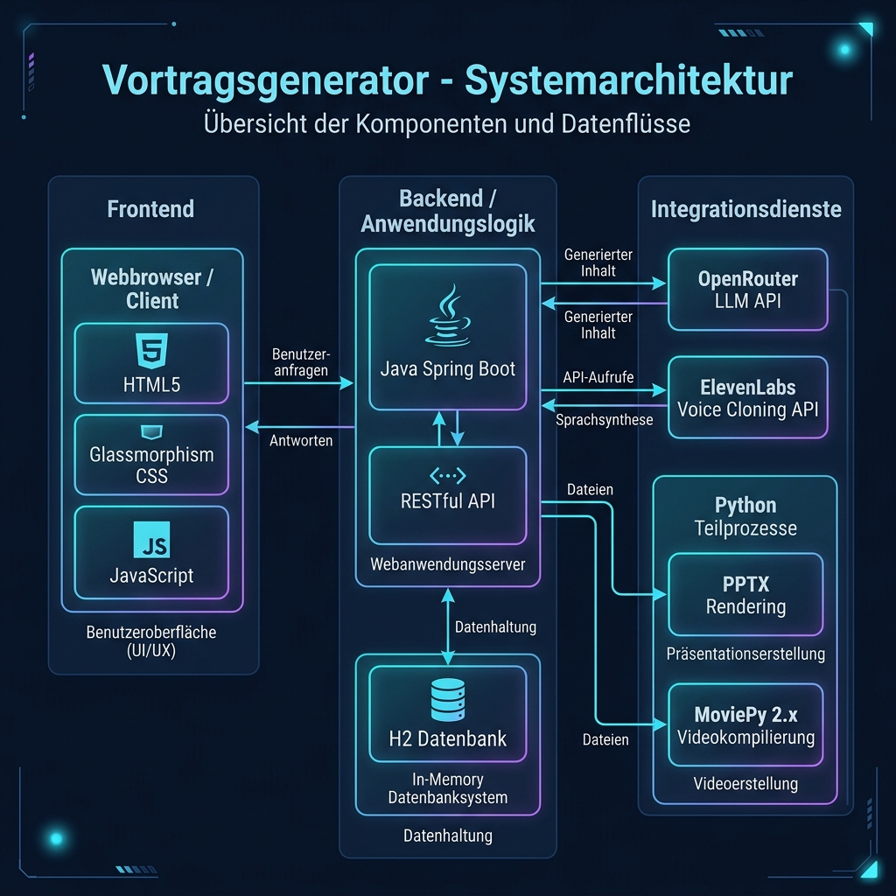
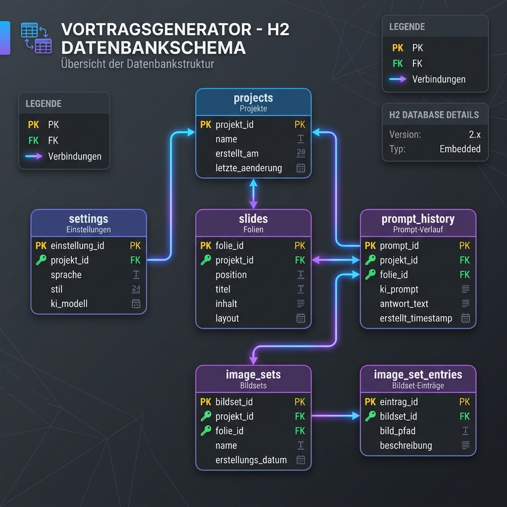

# Vortragsgenerator (Presentation Generator) 🚀

Der **Vortragsgenerator** ist eine vollautomatische Spring Boot Webanwendung, die aus einem einzigen Prompt komplette PowerPoint-Präsentationen inklusive Rednerskripten generiert und diese mit der eigenen, geklonten Stimme (ElevenLabs) vollautomatisch als Video vorträgt.

> [!IMPORTANT]
> **Showcase-Disclaimer:** Dieses Projekt wurde als Showcase-Projekt konzipiert und innerhalb von ca. 3 Stunden mit **Gemini 3.5 Flash** entwickelt. Es ist vollständig lauffähig, dient jedoch als Machbarkeitsnachweis und Demonstration. Für einen produktiven Multi-User-Einsatz oder erweiterte Features muss das System entsprechend für eigene Zwecke angepasst und gehärtet werden.

---

## 🛠️ Tech Stack & Architektur

Das System nutzt eine integrierte Architektur aus Java-Backend, SQL-Datenbank, KI-APIs und Python-Prozessautomatisierung:

- **Frontend:** HTML5, CSS (Premium Glassmorphism), Vanilla JS (`app.js`)
- **Backend:** Java Spring Boot 3 (Controllers, JPA Repositories, API Services)
- **Datenbank:** H2 Database (`vortrag_db.mv.db`) zur persistenten Speicherung von Projekten, Slides, Prompt-Historie und Image-Sets.
- **APIs:**
  - **OpenRouter REST API:** Zur Generierung der Folieninhalte und Sprechtexte (Standardmäßig über *Claude Opus 4.8* oder *Gemini 3.5 Flash*).
  - **ElevenLabs REST API:** Zur hochwertigen Stimmsynthese mittels des eigenen Voice-Clones (Instant Voice Cloning).
- **Automation Engine:** Python-Subprozesse unter Windows zur win32com PowerPoint-Steuerung (Folienelement-Export) und MoviePy 2.x Video-Compilation.

### Systemarchitektur



---

## 📋 Features

- 🪄 **Single-Prompt-Video:** Ein einziger Satz reicht aus, um Folien, Skripte und das fertige Video zu generieren.
- 📸 **KI-gestützte Bildplatzierung:** Eigene Screenshot-Sets hochladen und beschreiben. Die KI platziert die Grafiken passend auf den Slides.
- 📁 **Grafik-Sets:** Bilder können in Sets gespeichert und für zukünftige Vorträge wiederverwendet werden.
- 🔄 **Versionsverwaltung:** Speichert alle Versionen (`v1`, `v2`, `v3` etc.) eines Vortrags in der Datenbank.
- 🔍 **Autonome Recherche:** Die KI kann angewiesen werden, selbstständig im Web zu recherchieren und einen Vortrag zu erstellen.
- 📑 **Rednernotizen & PPTX:** Am Ende erhält man die voll editierbare PowerPoint-Datei (`.pptx`), das Skript (`.md`) und das Video (`.mp4`).

---

## 🎁 Vorinstallierte Beispiele (Out-of-the-box Seeding)

Das Projekt wird mit zwei fertig gerenderten Präsentationen ausgeliefert. Beim ersten Start der Anwendung werden diese Beispiele automatisch aus den Ressourcen in Ihr lokales Datenverzeichnis (`./data/projects/`) kopiert, sodass Sie die Anwendung sofort testen können, ohne API-Schlüssel für OpenRouter oder ElevenLabs hinterlegen zu müssen:

1. **Antigravity - Einführung für Designer** (Projekt-ID 1): Eine bildhafte und lockere Einführung in KI-Agenten, Systemdiagnosen und die Automatisierung von Bewerbungs-Pipelines.
2. **Vortragsgenerator - Der Überblick** (Projekt-ID 3): Eine umfassende, 20 Folien lange Präsentation, die alle Funktionen dieses Tools für Nicht-Techniker verständlich erklärt – inklusive fertiger PowerPoint-Datei, Folienbilder, Audiospuren und des kompletten Videos.

---

## 🗄️ Datenbank-Schema (H2)

Die relationale Datenhaltung ist wie folgt aufgebaut:



---

## 🚀 Setup & Installation

### Voraussetzungen
1. **Windows-Betriebssystem** (erforderlich für PowerPoint COM-Automation über `pywin32`).
2. **Microsoft PowerPoint** installiert.
3. **Java JDK 17+** und **Maven**.
4. **Python 3.9+** mit folgenden installierten Paketen:
   ```bash
   pip install requests pywin32 moviepy
   ```

### 1. API Keys konfigurieren
Zum Ausführen des Generators benötigen Sie:
- Einen API Key von [OpenRouter](https://openrouter.ai/)
- Einen API Key von [ElevenLabs](https://elevenlabs.io/) sowie eine generierte **Voice-ID** (erhältlich nach einem kurzen 30-sekündigen Voice-Cloning).

Tragen Sie diese in die Einstellungen der Webanwendung ein (oder über `src/main/resources/data.sql` / `application.properties`).

### 2. Projekt starten
Bauen und starten Sie die Spring Boot Anwendung über Maven:
```bash
mvn clean package
java -jar target/generator-0.0.1-SNAPSHOT.jar
```
Oder führen Sie die mitgelieferte `start.bat` im Root-Verzeichnis aus.

Öffnen Sie anschließend im Webbrowser:
👉 `http://localhost:8080`
