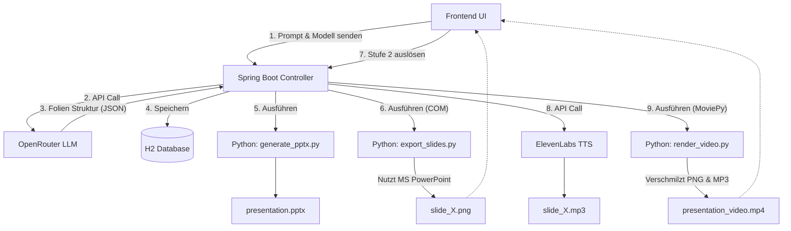

# System- & Entwicklerdokumentation: Vortragsgenerator

Der **Vortragsgenerator** ist ein webbasiertes Tool, mit dem Präsentationen vollautomatisch über einen Webserver in zwei Stufen generiert, vertont, gerendert und verwaltet werden können. Die Applikation baut auf Spring Boot (Java 21), H2 Database (lokal eingebettet) und Python (python-pptx, moviepy 2.x) auf und bietet eine moderne, responsive Benutzeroberfläche in Dunkelmodus-Ausschmückung.

---

## 📂 Verzeichnisstruktur (Projekt-Landkarte)

Die Applikation liegt unter `d:\AntiGravitySoftware\GitWorkspace\Vortragsgenerator` und ist wie folgt strukturiert:

```text
Vortragsgenerator/
├── pom.xml                                   # Maven Konfiguration (Spring Boot)
├── application.properties                    # Server- und DB-Konfiguration
├── data/                                     # Lokaler Dateispeicher für Projekte (wird generiert)
│   ├── vortrag_db.mv.db                      # H2 Datenbank Datei
│   └── projects/
│       └── {project_id}/                     # Projektspezifische Artefakte (pptx, mp4, mp3s)
├── python/                                   # Python Integrations-Skripte
│   ├── generate_pptx.py                      # PowerPoint Erstellung (python-pptx)
│   ├── export_slides.py                      # COM Export zu PNGs (win32com)
│   └── render_video.py                       # Audio/Bild Synthese zu Video (moviepy)
├── doc/
│   └── Presentation_Generator_Doku.md        # Diese Systemdokumentation
└── src/
    └── main/
        ├── java/com/vortrag/generator/       # Spring Boot Java Code
        │   ├── VortragGeneratorApplication   # Hauptklasse
        │   ├── controller/                   # REST API Controller
        │   ├── model/                        # JPA Entities
        │   ├── repository/                   # JPA Repository Schnittstellen
        │   └── service/                      # Services (OpenRouter, ElevenLabs, ProcessBuilder)
        └── resources/
            ├── schema.sql                    # H2 Schema Definition
            ├── data.sql                      # Claude Beispiel-Vortrag & Standardeinstellungen
            └── static/                       # Frontend Web UI (Single Page Application)
                ├── index.html                # HTML5 Layout
                ├── css/style.css             # Premium Styling (Glassmorphism, Neon Violet)
                ├── js/app.js                 # Frontend Logik, Modals und Polling
                └── images/                   # Mascot- und Cartoon-PNG-Dateien (Seeding)
```

---

## ⚙️ Systemarchitektur & Datenfluss

Die Applikation arbeitet im zweistufigen System:



---

## 🛠️ Voraussetzungen & Installation

### 1. Runtimes & Abhängigkeiten
- **Java 21** & **Maven** (zum Ausführen und Bauen des Backends)
- **Python 3.12** mit folgenden installierten Paketen:
  - `python-pptx` (Generierung von `.pptx`)
  - `pywin32` (PowerPoint COM API Bridge auf Windows)
  - `moviepy >= 2.0.0` (Video-Rendering)
  - `requests` (API Calls)
- **Microsoft PowerPoint** (wird vom COM-Export auf Windows benötigt, um Folien hochqualitativ in PNGs zu konvertieren)

---

## 🚀 Ausführung und Inbetriebnahme

1. **Server starten**:
   Öffne die PowerShell im Verzeichnis `d:\AntiGravitySoftware\GitWorkspace\Vortragsgenerator` und starte den Server:
   ```powershell
   mvn spring-boot:run
   ```
2. **Weboberfläche aufrufen**:
   Navigiere im Browser zu: `http://localhost:8080`
3. **Datenbank Console**:
   Die H2 Web-Console ist unter `http://localhost:8080/h2-console` erreichbar.
   - **JDBC URL**: `jdbc:h2:file:./data/vortrag_db`
   - **Username**: `sa`
   - **Passwort**: `[LEER]`

---

## 💡 Benutzung des Tools

### Stufe 1: Erstellung & Folien-Design
1. Klicke im Sidebar-Menü auf **Neues Projekt**.
2. Wähle das gewünschte Modell (z. B. **Claude Opus 4.8** oder **Kimi Latest**).
3. Gib einen Titel und einen detaillierten Prompt ein und klicke auf **Projekt anlegen**.
4. Wähle dein Projekt im **Dashboard** aus und klicke auf **Stufe 1 ausführen**. Das Backend sendet die Anfrage an OpenRouter, erstellt die Folien in der DB, generiert die PowerPoint-Datei und exportiert die Folien als Bilder.
5. Nach Abschluss siehst du die Folien-Bilder in der Übersicht. Klicke auf eine Folie, um Textinhalte anzupassen, Bulletpoints hinzuzufügen/zu entfernen oder das passende Cartoon-Maskottchen auszuwählen.

### Stufe 2: Vertonung & Rendering
1. Klicke auf **Stufe 2 ausführen**.
2. Das System sendet die Sprechtexte Folie für Folie an ElevenLabs, lädt die MP3s herunter und fügt sie lokal mit den Folienbildern mithilfe von `moviepy` zu einem synchronen MP4-Vortrag zusammen.
3. Sobald das Rendering abgeschlossen ist, erscheint der **Vortrags-Video-Player** und du kannst dir das Video direkt im Browser anschauen.
4. Über die Buttons kannst du die `.pptx` PowerPoint-Präsentation oder das fertige `.mp4` Video herunterladen.

---

## 🔒 Kostenoptimierte Sprach-Generierung (ElevenLabs Cache)
Damit keine ElevenLabs-Zeichen-Credits unnötig verschwendet werden, wendet das System ein intelligentes Caching-Verfahren an:
- Wenn Stufe 2 ausgeführt wird, prüft das Backend für jede Folie, ob bereits eine Audiodatei existiert. Ist dies der Fall, wird sie wiederverwendet.
- **Folienänderung im Editor**: Wenn du im Slide-Editor die gesprochenen Notizen einer Folie änderst und speicherst, löscht das Backend automatisch die dazugehörige MP3-Datei.
- Beim nächsten Klick auf **Stufe 2 ausführen** wird die Stimme **nur für die geänderten Folien** neu generiert. Unveränderte Folien werden direkt aus dem Dateisystem gecacht.

---

## 🎤 ElevenLabs Kurzanleitung: Anmeldung & Stimmenklon

Damit die Vertonung mit deiner eigenen Stimme funktioniert, müssen der **ElevenLabs API-Key** und die **Voice-ID** in den Einstellungen eingetragen sein. Hier ist die Schritt-für-Schritt-Anleitung:

### 1. ElevenLabs Account registrieren
1. Besuche die offizielle Webseite [elevenlabs.io](https://elevenlabs.io) und erstelle einen kostenlosen Account.
2. Nach der Anmeldung findest du deinen API-Key, indem du unten links auf dein **Profil-Symbol** (deinen Benutzernamen) klickst und auf **Profile + API-Keys** gehst.
3. Klicke auf das Auge-Symbol, um den Key anzuzeigen, kopiere ihn und trage ihn in den Einstellungen der Web-Oberfläche unter *ElevenLabs API-Key* ein.

### 2. Eigene Stimme klonen (Instant Voice Cloning)
1. Klicke im linken Hauptmenü auf **Voices** und wähle **Add voice**.
2. Klicke auf das Feld **Instant Voice Cloning** (Stimme klonen).
3. **Aufnahme machen**: Lade eine Audio-Datei deiner Stimme hoch.
   - *Tipp für beste Ergebnisse*: Nimm dich ca. 1-2 Minuten lang in einer ruhigen Umgebung ohne Hintergrundgeräusche auf. Lies einfach einen beliebigen deutschen Text flüssig vor.
   - Das Hochladen einer kurzen, sauberen `.mp3` oder `.wav` Datei reicht vollkommen aus.
4. Gib der Stimme einen Namen, akzeptiere die Nutzungsbedingungen und klicke auf **Create Voice**.

### 3. Voice-ID ermitteln
1. Nach der Erstellung siehst du deine Klonstimme in der Liste.
2. Klicke auf das kleine **ID-Symbol** (oder auf das Auge/Optionen-Symbol) direkt unter dem Namen deiner Stimme, um die eindeutige ID (z.B. `l2LQHKd2l5T7VWaA31ma`) anzuzeigen.
3. Kopiere diese Zeichenkette und trage sie in den Einstellungen der Web-Oberfläche unter *ElevenLabs Voice-ID* ein.

---

## 🛠️ API Referenz (REST)

- `GET /api/projects`: Liste aller Projekte.
- `GET /api/projects/{id}`: Details eines Projekts.
- `POST /api/projects`: Erstellt ein leeres Projekt.
- `DELETE /api/projects/{id}`: Löscht ein Projekt und dessen Ordner im Dateisystem.
- `GET /api/projects/{id}/slides`: Holt alle Folien eines Projekts sortiert nach Foliennummer.
- `PUT /api/projects/{id}/slides/{slideId}`: Aktualisiert Folientext, Aufzählungspunkte und Bildzuordnungen.
- `POST /api/projects/{id}/generate-pptx`: Stufe 1 (LLM Call + PPTX-Bauen + COM PNG-Export).
- `POST /api/projects/{id}/generate-audio`: Stufe 2 (ElevenLabs TTS Synthese + Video Rendering).
- `GET /api/projects/{id}/slides/{number}/image`: Liefert das exportierte PNG-Folienbild.
- `GET /api/projects/{id}/slides/{number}/audio`: Liefert die synthetisierte MP3-Audiodatei.
- `GET /api/projects/{id}/video`: Streamt das fertig gerenderte MP4-Vortragsvideo.
- `GET /api/projects/{id}/pptx`: Lädt die PowerPoint-Datei (.pptx) herunter.
- `GET /api/settings`: Liefert maskierte Einstellungen.
- `POST /api/settings`: Aktualisiert API-Keys.
- `GET /api/models`: Liste der OpenRouter Modelle.
- `GET /api/images`: Liste der verfügbaren Cartoon-Grafiken.
- `GET /api/prompt-history`: Liefert die Chronologie der genutzten Prompts.
